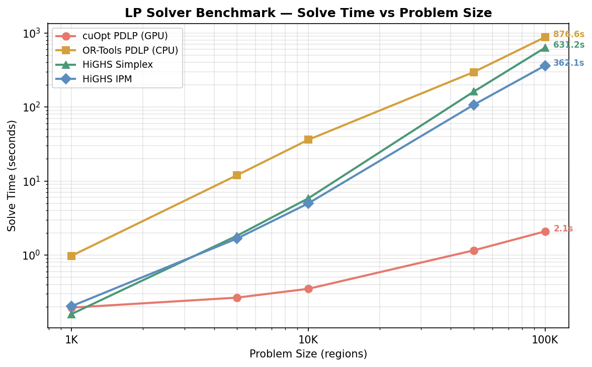
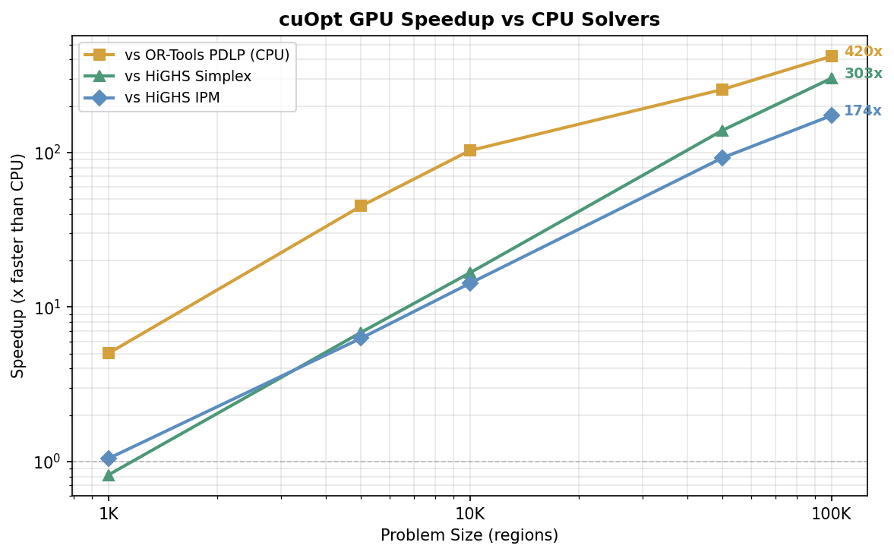
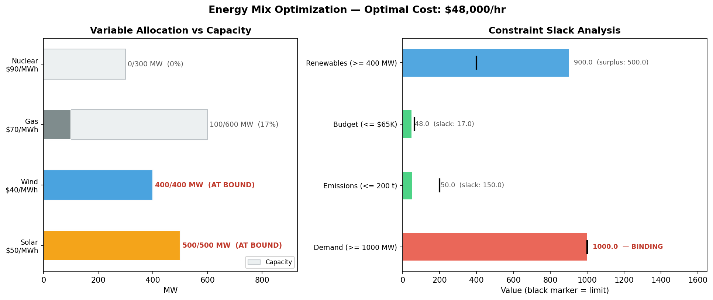

# GPU Optimization with NVIDIA cuOpt

Optimization problems solved with [NVIDIA cuOpt](https://docs.nvidia.com/cuopt/user-guide) on GPU, orchestrated by [Metaflow](https://metaflow.org/).

## The Problems

### 1. Farm Planning (LP)

> An agricultural company manages 10,000 farm regions. Each region can grow wheat, corn, soybeans, or cotton. Every region has its own land and water limits. Five shared labor pools serve all regions, and global market caps limit how much of each crop can be sold. **Maximize total profit by deciding how many acres of each crop to plant in each region.** Then sweep crop prices to test sensitivity.

**Formulation:** 4 variables per region (acres of each crop). Per-region land and water constraints, global market caps per crop, and shared labor pool constraints. All constraints are `<=` inequalities on a sparse CSR matrix. Structure: 4n variables, 2n+9 constraints, 32n nonzeros — scales linearly in region count.

**Flow:** `flows/lp-minimal/flow.py` | **Type:** Linear Program (40K variables, 20K constraints)

### 2. Portfolio Optimization (MAD LP)

> An investor has 200 stocks with a year of daily returns. For a given target return, find the portfolio that **minimizes risk**, measured by Mean Absolute Deviation (an LP alternative to Markowitz variance). Sweep across 20 return targets to trace the efficient frontier.

**Flow:** `flows/qp-minimal/flow.py` | **Type:** Linear Program (452 variables per frontier point, 506 constraints)

### 3. Warehouse Location (MILP)

> A logistics company has 100 candidate warehouse sites and 500 customers. Each warehouse has a fixed opening cost. Shipping cost depends on distance and demand. **Decide which warehouses to open (yes/no) and how to assign customers to minimize total cost.** Compare GPU-only heuristics (fast, approximate) against full branch-and-bound (exact, slower).

**Flow:** `flows/milp-minimal/flow.py` | **Type:** Mixed-Integer LP (100 binary + 50K continuous variables)

### 4. Delivery Routing (VRP)

> A delivery company has a depot and customers scattered across a city in clusters (like real neighborhoods). Trucks have limited capacity. **Find routes for the trucks that visit every customer, respect capacity, and minimize total distance.** Run at 50, 200, 500, and 1,000 customers in parallel to see how GPU routing scales.

**Flow:** `flows/vrp-minimal/flow.py` | **Type:** Capacitated Vehicle Routing (50-1000 customers, foreach fanout)

### 5. LP Solver Benchmark

> Same farm planning problem as #1, run at 1K–100K regions with four solvers: cuOpt PDLP (GPU), OR-Tools PDLP (CPU), HiGHS Simplex, and HiGHS IPM. All solvers receive identical scipy CSR sparse input. **Isolates GPU vs CPU for the same algorithm (PDLP) and compares first-order methods against classical solvers.**

**Flow:** `flows/lp-benchmark/flow.py` | **Type:** LP scaling benchmark (4 solvers, 5 sizes, 20 tasks)

## Benchmark Results

At 100K regions (400K variables, 3.2M nonzeros), cuOpt on a single A10G GPU solves in **2.1 seconds**. The same PDLP algorithm on CPU (OR-Tools) takes 877 seconds — a **420x speedup** from GPU acceleration alone. Against classical CPU solvers, cuOpt is 303x faster than HiGHS Simplex and 174x faster than HiGHS IPM.

The speedup grows with problem size. At 1K regions all solvers finish in under a second; by 100K regions the gap is three orders of magnitude.




Regenerate these charts from the latest run: `python scripts/benchmark_charts.py`

## Smoke Test: Energy Mix LP

A quick validation that the cuOpt server deployment is working. Solves a small energy portfolio problem: find the cheapest mix of Solar ($50/MWh), Wind ($40), Gas ($70), and Nuclear ($90) to power a 1,000 MW city, subject to an emissions cap, budget limit, and minimum renewable requirement.

The solver maxes out the two cheapest sources (Wind at 400 MW, Solar at 500 MW), fills the gap with 100 MW of Gas, and skips Nuclear entirely — total cost $48,000/hr. The visualization shows which variables hit their capacity bounds and which constraints are binding vs slack.



Run it: `METAFLOW_PROFILE=yellow python scripts/smoke_test.py`

## Deployment Patterns

Two ways to run cuOpt — **batch over GPU fanout** (for example, in Metaflow each solve step gets its own GPU pod and some number of problem instances) and **persistent GPU server** (shared cuOpt REST API). All five flows above use per-step GPU. The `deployments/cuopt-server/` directory shows the server pattern in a way packaged for running as an [Outerbounds Deployment](https://docs.outerbounds.com/outerbounds/get-started-inference/), but you can run this on any GPU-enabled server. See [docs/deployment-patterns.md](docs/deployment-patterns.md) for details and when to use each.

## Why Metaflow?

Each flow demonstrates practical patterns for running optimization on managed infrastructure:

- **`@kubernetes(gpu=1, compute_pool='gpu-multi-training')`** — GPU provisioning. Steps that need a GPU get one; steps that don't run on CPU pools. No cluster management.
- **`@conda(packages={...})`** — Dependency isolation. cuOpt + RAPIDS on GPU nodes, scipy on CPU nodes. Each step gets exactly the packages it needs.
- **`foreach`** — Parallel fan-out. The farm LP sweeps 5 price scenarios simultaneously. The VRP solves 4 instance sizes in parallel. The benchmark tests 5 sizes per solver concurrently.
- **Branching DAG** — The MILP flow runs heuristic and exact solvers in parallel branches. The benchmark flow runs 4 solver branches in parallel, each fanning out across 5 sizes.
- **`@card`** — Every flow produces a visual result card (charts, tables) viewable in the Outerbounds UI.
- **`@gpu_profile`** — GPU utilization tracking on every GPU step.
- **`outerbounds app deploy`** — Persistent GPU services. cuOpt server runs as a long-lived deployment; flows call it via REST.

The key point: **Metaflow handles the infrastructure** (GPU scheduling, dependency packaging, parallel execution, artifact passing) so you can focus on the optimization problem itself. Each flow is a single Python file.

## Quick Start

```bash
PYTHONPATH="$PWD" python flows/lp-minimal/flow.py --environment=fast-bakery run
```

## Architecture

```
cuopt-project/
├── obproject.toml              # Outerbounds project config
├── src/
│   ├── __init__.py             # METAFLOW_PACKAGE_POLICY = 'include'
│   └── problems/
│       ├── farm_lp.py          # Farm LP builder (sparse scipy CSR)
│       └── cvrp.py             # CVRP instance generator (clustered)
├── deployments/
│   └── cuopt-server/
│       └── config.yml          # Persistent GPU server (Outerbounds Deployment)
├── scripts/
│   ├── smoke_test.py           # Energy Mix LP smoke test + visualization
│   └── benchmark_charts.py     # Regenerate benchmark charts from Metaflow artifacts
└── flows/
    ├── lp-minimal/flow.py      # Farm planning LP
    ├── qp-minimal/flow.py      # Portfolio MAD LP
    ├── milp-minimal/flow.py    # Warehouse location MILP
    ├── vrp-minimal/flow.py     # Delivery routing VRP (multi-scale)
    └── lp-benchmark/flow.py    # LP solver benchmark (4 solvers)
```